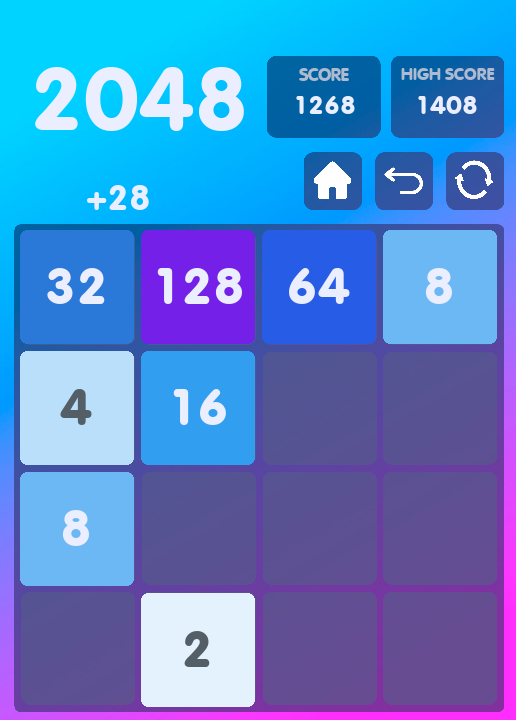

<div align="center">
  
  <h1>2048</h1>

  <p>Game 2048 written in Python, pygame module. First pet-project. cringe...</p>

<!-- Badges -->
<p>
  <a href="https://github.com/Qu1nel/2048/graphs/contributors">
    
  </a>
  <a href="https://github.com/Qu1nel/2048/commits/main">
    
  </a>
  <a href="https://github.com/Qu1nel/2048/network/members">
    
  </a>
  <a href="https://github.com/Qu1nel/2048/stargazers">
    
  </a>
  <a href="https://github.com/Qu1nel/2048/issues/">
    
  </a>
</p>

<p>
  <a href="https://www.python.org/downloads/release/python-3110/" >
    
  <a>
  <a href="https://github.com/Qu1nel/2048/releases/">
    
  <a>
  <a href="https://github.com/Qu1nel/2048/blob/main/LICENSE">
    
  </a>
  <a href="">
    
  </a>
</p>

<h4>
  <a href="#view-demo">View Demo</a>
  <span> · </span>
  <a href="#documentation">Documentation</a>
  <span> · </span>
  <a href="https://github.com/Qu1nel/2048/issues/">Report Bug</a>
  <span> · </span>
  <a href="https://github.com/Qu1nel/2048/issues/">Request Feature</a>
</h4>
</div>

<br />

<!-- Table of Contents -->

# Contents

- [About the Project](#about-tictactoe)
    - [Screenshots](#screenshots)
- [Installation](#installation)
    - [Requirements](#requirements)
- [Getting started](#getting-started)
    - [Windows](#windows)
    - [Linux](#linux)
- [Documentation](#documentation)
- [Developers](#developers)
- [License](#license)

## About 2048


First project after 2.5 months of learning Python

Game 2048 written in Python, pygame module. Also used SQLite for the database of players and their results.

<details>
  <summary><h3 id="screenshots">Screenshots</h3></summary>
  <div align="center">
    
  </div>
</details>

## Installation

Clone the repository and run the file `run.py`.

### Requirements

_The [`Python`](https://www.python.org/downloads/) interpreter version 3.11+ and
preferably [`poetry`](https://python-poetry.org/)_

Install requirements with `poetry`:

```bash
poetry install
```

## Getting started

Clone this repository and navigate to it with the command:

```bash
git clone https://github.com/Qu1nel/2048.git
cd 2048/
```

If you have the `make` and `poetry` installed, you can run the game with the command:

```bash
make run
```

Or

```bash
poetry run python run.py
```

Or you can simply run `run.py` using the python interpreter

#### Windows

```powershell
python run.py
```

#### Linux

```bash
python3 run.py
```

## Documentation

#### Controls & Keys

|  Key  |                       Move                        |
|:-----:|:-------------------------------------------------:|
| H / h |  Returns to the main menu, saving game progress   |
| R / r |      Resets the game to a further agreement       |
| B / b | Returns the state of the game that was 1 turn ago |

#### Other Keys

|    Key    |                 Move                  |
|:---------:|:-------------------------------------:|
| Backspace |          Cancels the action           |
|  Escape   | Leaves the game or cancels the action |
|   Enter   |            Confirms action            |

<u><b>Mouse swipes are also available within the game area.</b></u>

For full help with make commands, you can use the command:

```bash
make help
```

## Developers

- [Qu1nel](https://github.com/Qu1nel)

## License

[MIT](./LICENSE) © [Ivan Kovach](https://github.com/Qu1nel/)

This Project Qu1nel.2048 in distributive under the **[MIT License](./LICENSE)**, and it also uses those codes that are
distributed under the **[MIT License](./LICENSE)**.
