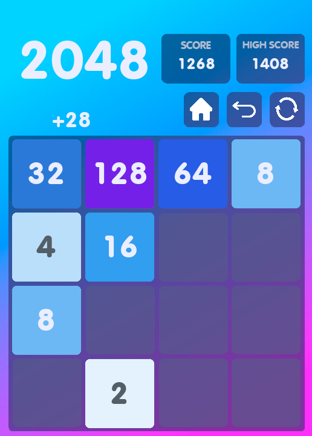

      

   
   
   

## About 2048

First project after 2.5 months of learning Python

Game 2048 written in Python, pygame module. Also used SQLite for the database of players and their results.

Maybe I'll rewrite this <s>miracle</s>

## Installation

Clone the repository and run the file ***main.py***.
Make sure that all [requirements](#requirements) are met.

## Requirements

_The Python interpreter version 3.9+_

All python dependencies specified in the file [requirements.txt](/requirements.txt)

    pip install -r requirements.txt

## Documentation

#### Controls & Keys
| Key | Move |
| :---------------: | :---------------: |
|  H / h | Returns to the main menu, saving game progress |
| R / r | Resets the game to a further agreement |
| B / b | Returns the state of the game that was 1 turn ago |

#### Other Keys
| Key | Move |
| :---------------: | :---------------: |
|  Backspace | Cancels the action |
| Escape | Leaves the game or cancels the action |
| Enter | Confirms action |

<u><b>Mouse swipes are also available within the game area.</b></u>

## Developers

- [Qu1nel](https://github.com/Qu1nel)

## License

Project Qu1nel.2048 is distributed under the [MIT license](LICENSE).
